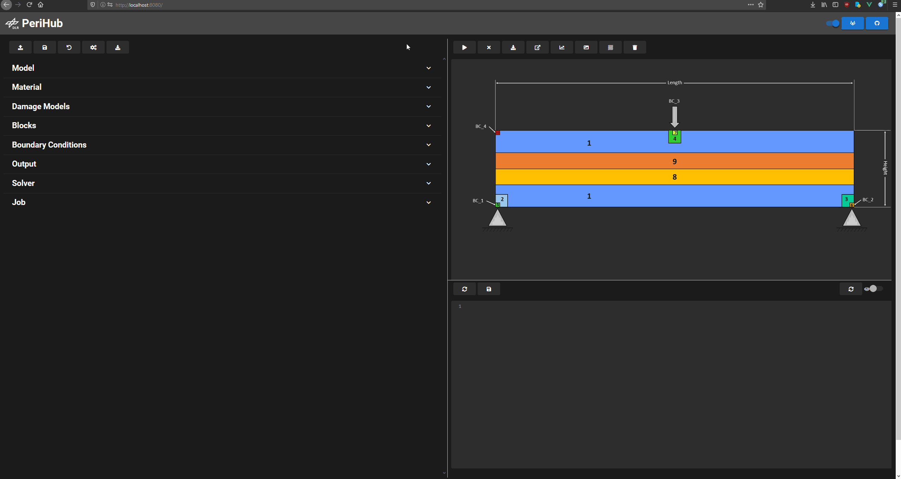
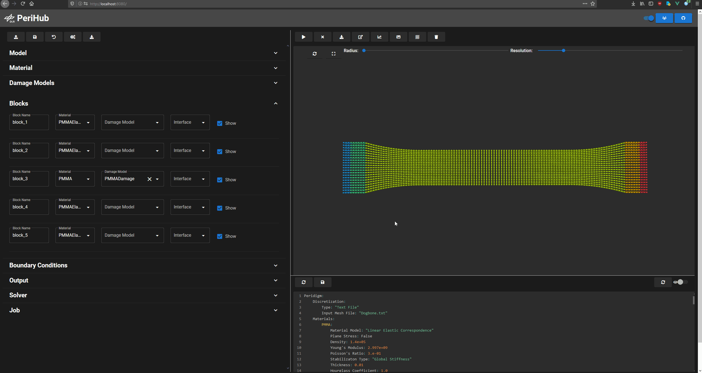
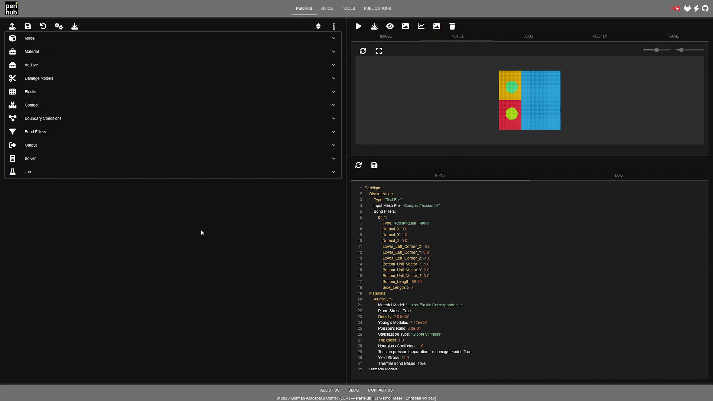
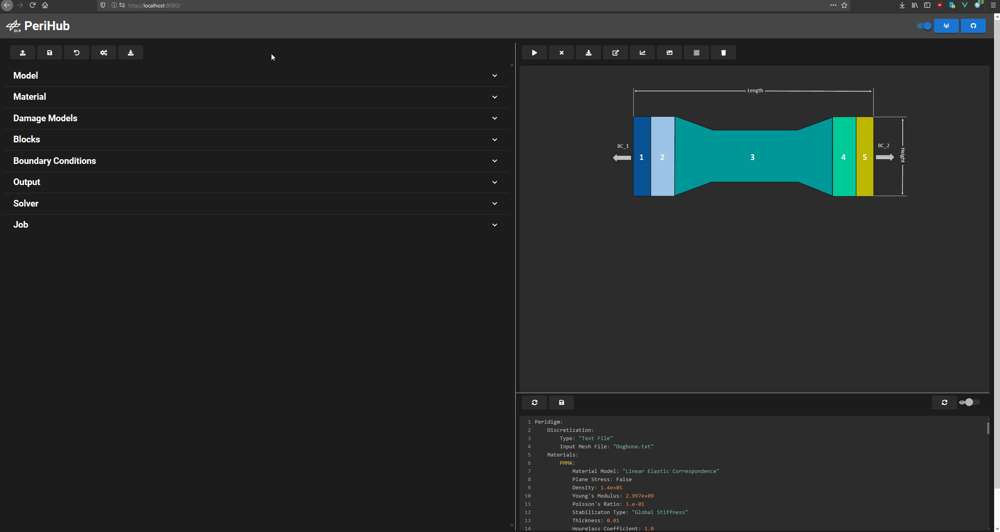
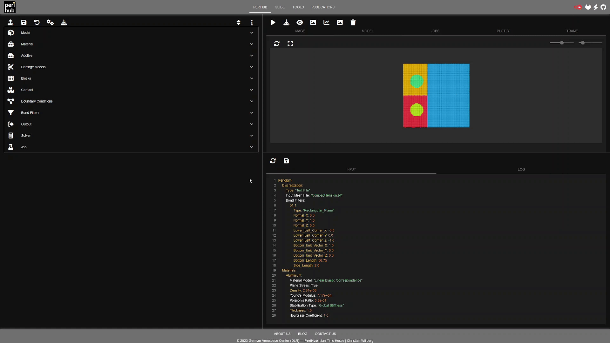

<!--
SPDX-FileCopyrightText: 2023 PeriHub <https://github.com/PeriHub>

SPDX-License-Identifier: Apache-2.0
-->

# PeriHub

PeriHub enables the generation, editing, execution and evaluation of standard peridynamic models.


### Generate model

### View generated mesh

### Edit input deck

### Add materials or damage models

### Submit model

### Analyse results


## Building locally
Clone the repository
```
git clone https://github.com/PeriHub/PeriHub.git
```
Go into the perihub folder.
```
cd perihub
```
Create a .env file and save following variables.
```
echo "DEV=True
DLR=False
VOLUME={PATHTOJOBFOLDER}" >> .env
```
Run docker-compose.
```
docker-compose up
```
If docker finished building PeriHub, go to http://localhost:6010
## Contact
* [Jan-Timo Hesse](mailto:Jan-Timo.Hesse@dlr.de)

## License

Please see the file [LICENSE.md](LICENSE.md) for further information about how the content is licensed.
