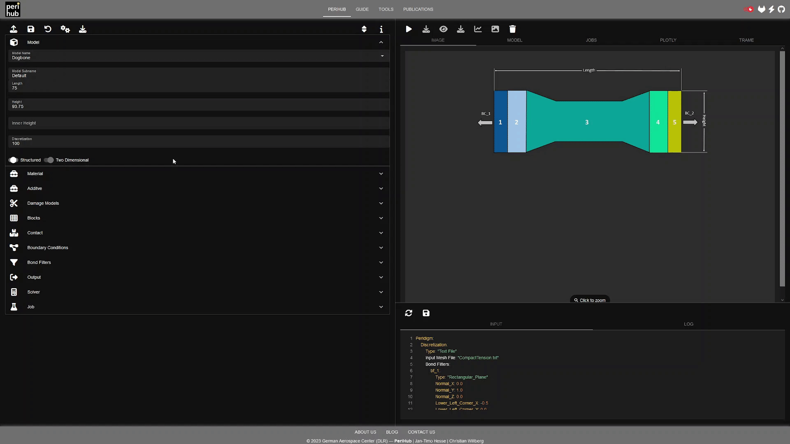
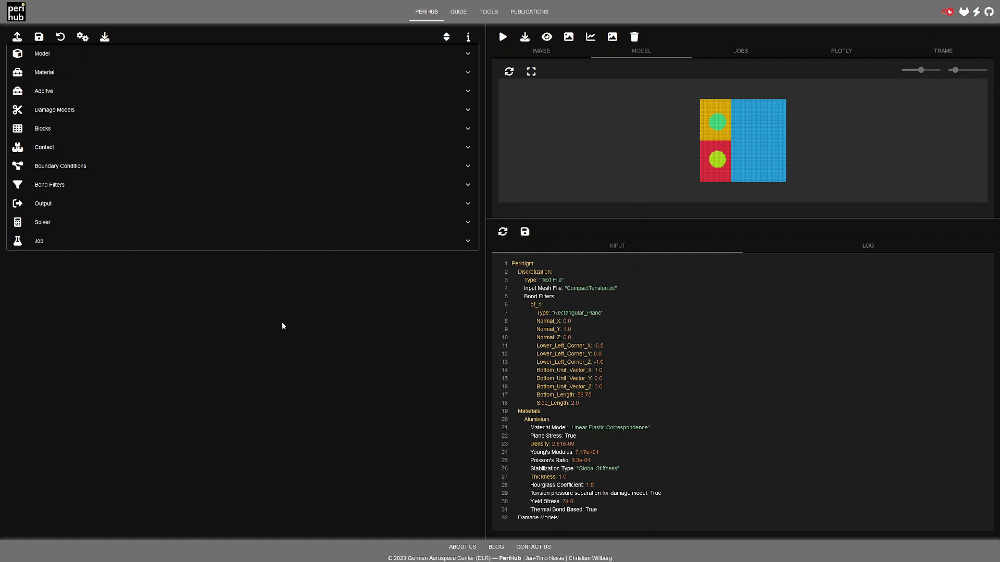
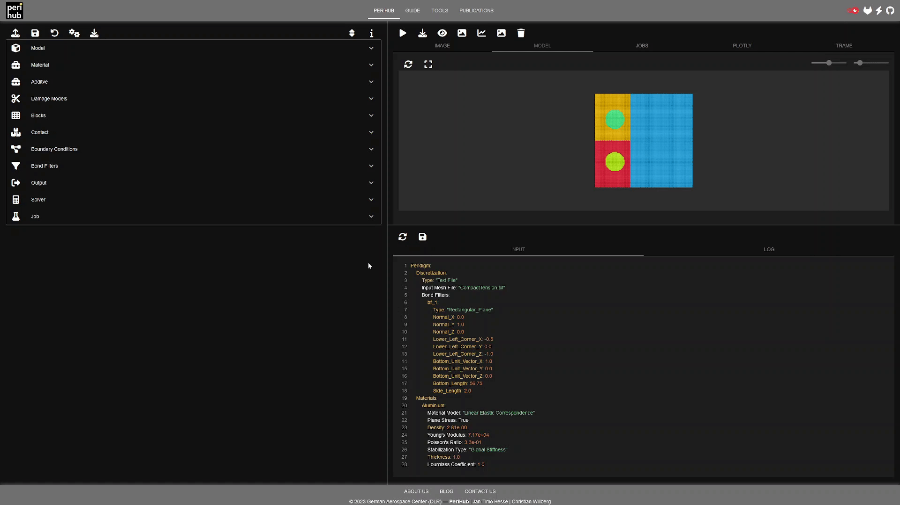

<!--
SPDX-FileCopyrightText: 2023 PeriHub <https://github.com/PeriHub/PeriHub>

SPDX-License-Identifier: Apache-2.0
-->

# PeriHub - Empowering Research with Peridynamic Modeling

[](https://github.com/PeriHub/PeriLab.jl/actions)
[](https://perihub.github.io/PeriHub/)
[](https://github.com/PeriHub/PeriHub/blob/main/LICENSE.md)
[](https://doi.org/10.5281/zenodo.8159334)
[](https://hub.docker.com/r/perihub/frontend)
[](https://www.youtube.com/@PeriHub)

PeriHub is a powerful software solution that can significantly benefit research in various fields. It is an extension of the open-source PeriLab software, providing a numerical implementation of the peridynamic theory. With PeriHub, researchers gain access to a valuable tool for addressing specific challenges and exploring diverse use cases in materials science, engineering, and related disciplines.

## Key Features

- **Peridynamic Modeling:** PeriHub excels at facilitating peridynamic modeling, enabling researchers to analyze material behavior and complex systems. Its unique approach empowers users to explore new frontiers and deepen their understanding of material behavior.

- **User-Friendly Interface:** PeriHub offers a user-friendly interface, making it accessible to both experienced researchers and newcomers in the field. The platform's ease of use ensures efficient simulations, analysis of results, and gaining valuable insights into material behavior.

- **REST API and GUI Support:** Researchers can seamlessly interact with PeriHub using its REST API and GUI support, providing flexibility and convenience in conducting simulations and research tasks.

- **High-Quality and Reliable:** Developed collaboratively by a dedicated group of experts, PeriHub adheres to high standards of quality, reliability, and FAIRness (Findability, Accessibility, Interoperability, and Reusability). The German Aerospace Center (DLR) has played a significant role in fostering an environment that encourages innovation and interdisciplinary collaboration throughout the software's development process.

- **Portability and Scalability:** PeriHub utilizes Docker containers, ensuring seamless integration and deployment across various computing environments. This approach enhances the software's portability, scalability, and ease of use, making it even more practical for research purposes.

### Overview


### Generate model



### View generated mesh


### Edit input deck



### Submit model



### Analyse results


### Plot results


### Analyse fracture


# Getting Started with PeriHub Services

To get started with PeriHub, you can use Docker Compose to easily set up the required services. Here's a step-by-step guide:

- Clone the repository

```
git clone https://github.com/PeriHub/PeriHub.git
```

- Go into the PeriHub folder.

```
cd PeriHub
```

- Copy the .env file and edit its contents (Optional).

```
cp .env.example .env
```

- Run docker-compose.

```
docker-compose up
```

- If docker finished starting PeriHub, go to http://localhost:8080

# Contributing

If you like to start PeriHub in a development mode, you will need to install following requirements

## Requirements

- Install the [node version manager](https://github.com/nvm-sh/nvm?tab=readme-ov-file#install--update-script) and node itself

```
curl -o- https://raw.githubusercontent.com/nvm-sh/nvm/v0.40.3/install.sh | bash
source ~/.bashrc
nvm install --lts
```

- Now you can get the [quasar cli](https://quasar.dev/start/quick-start) and install the node packages

```
cd frontend/app
npm i -g @quasar/cli
npm install
```

- For the python backend we need to make sure that [pip](https://pip.pypa.io/en/stable/installation/), [fastapi](https://fastapi.tiangolo.com/) and further dependencies are installed

```
cd backend
pip install "fastapi[standard]"
pip install -r requirements.txt
pip install git+https://github.com/JTHesse/crackpy.git
```

Now you are able to start the services

## Starting the services

```
cd frontend/app
quasar dev
```

```
cd backend/app
fastapi dev main.py
```

> If you also want to submit any simulations, make sure to start the perilab container:

```
docker compose up perilab -d
```

## Contact

- [Jan-Timo Hesse](mailto:Jan-Timo.Hesse@dlr.de)

## License

Please see the file [LICENSE.md](LICENSE.md) for further information about how the content is licensed.
