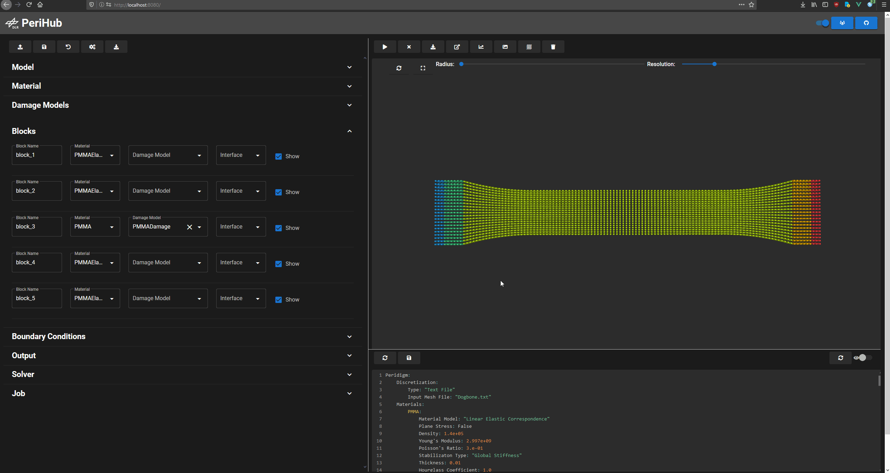
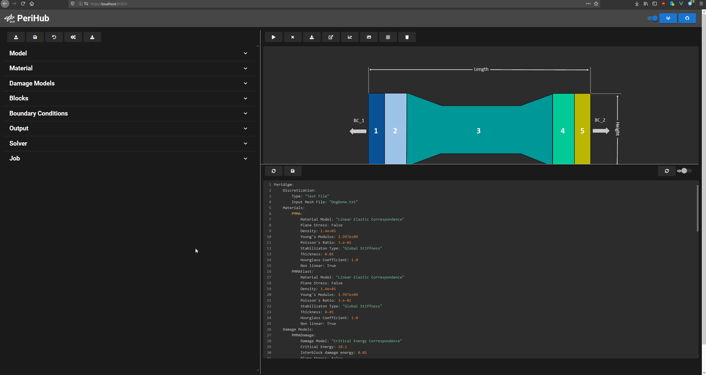
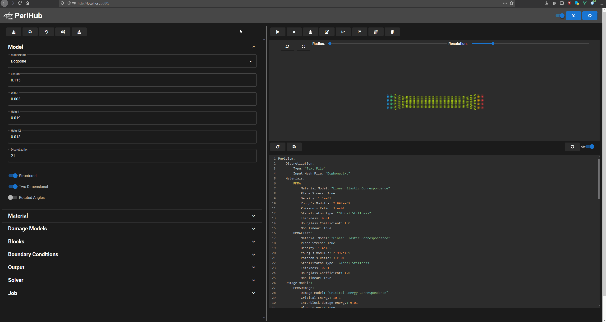
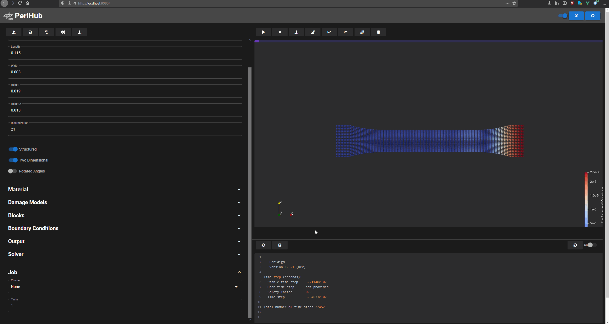

# PeriHub
PeriHub enables the generation, editing, execution and evaluation of standard peridynamic models

- FA-Services: https://perihub.fa-services.intra.dlr.de/
- API: https://perihub-api.fa-services.intra.dlr.de/docs

### Generate model

### View generated mesh

### Edit input deck

### Add materials or damage models

### Submit model

### Analyse results



## Building locally
Clone the repository
```
git clone https://gitlab.dlr.de/fa_sw/perihub.git
```
Go into the perihub folder.
```
cd perihub
```
Create a .env file an save your git username and token, in order to get the peridigm code.
```
echo "GITHUB_TOKEN=<YourToken>
GITHUB_USER=<YourUsername>
EXTERNAL=False" >> .env
```
Run docker-compose.
```
cd ..
docker-compose up
```
## Contact
* [Jan-Timo Hesse](mailto:Jan-Timo.Hesse@dlr.de)
